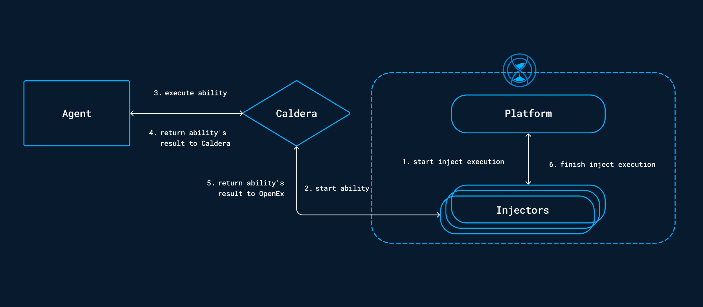

# OpenEx Caldera injector

The Caldera injector is a maven dependency allowing to perform Caldera abilities action through OpenEx.

## Summary

- [Requirements](#requirements)
    - [Deploy a Caldera instance](#deploy-a-caldera-instance)
- [Configuration variables](#configuration-variables)
- [Behavior](#behavior)
    - [Mapping](#mapping)
- [Sources](#sources)

---

### Requirements

- OpenEx Platform version 3.6.0 or higher with caldera injector dependency
- A deployed Caldera instance with **plugin access enable**

#### Deploy a Caldera instance

To deploy a Caldera instance, you can follow the [documentation](https://caldera.readthedocs.io/en/latest/) and use
this [github repository](https://github.com/mitre/caldera?tab=readme-ov-file).

### Configuration variables

Below are the properties you'll need to set for OpenEx:

| Property                 | application.properties         | Docker environment variable      | Mandatory | Description                                              |
|--------------------------|--------------------------------|----------------------------------|-----------|----------------------------------------------------------|
| Enable Caldera collector | injector.caldera.enable        | `INJECTOR_CALDERA_ENABLE`        | Yes       | Enable the Caldera injector.                             |
| Injector ID              | injector.caldera.id            | `INJECTOR_CALDERA_ID`            | Yes       | The ID of the injector.                                  |
| Collector IDs            | injector.caldera.collector-ids | `INJECTOR_CALDERA_COLLECTOR_IDS` | Yes       | The collector IDs compatible with the injection process. |
| Caldera URL              | injector.caldera.url           | `INJECTOR_CALDERA_URL`           | Yes       | The URL of the Caldera instance.                         |
| Caldera API Key          | injector.caldera.api-key       | `INJECTOR_CALDERA_API_KEY`       | Yes       | The API Key for the rest API of the Caldera instance.    |

### Behavior

The list of available injects will be updated with all Caldera abilities found.
These new injects can be used by targeting an asset or a group of assets from the OpenEx platform.

The following async workflow will be carried out on the caldera injects :

### Sources

- [Caldera](https://caldera.mitre.org/)
